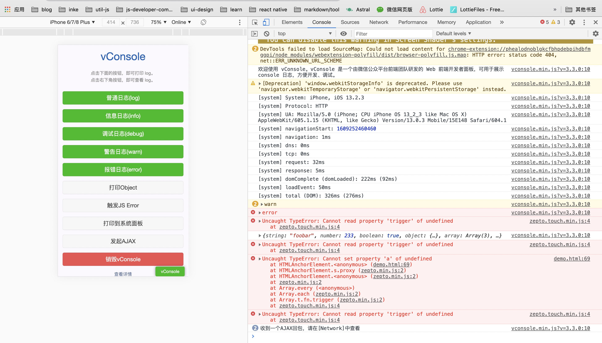
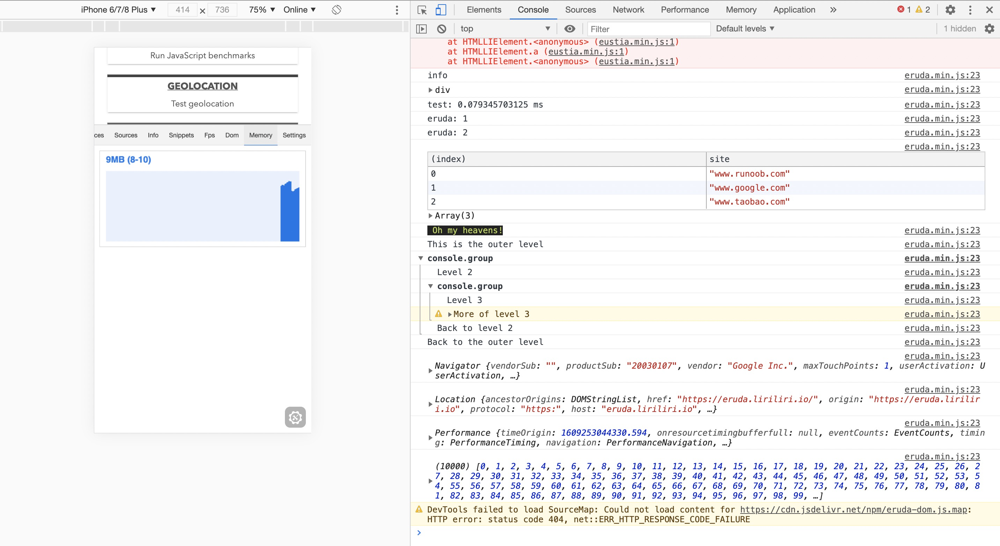

# 移动端调试

### 🤓

https://aotu.io/notes/2017/02/24/Mobile-debug/index.html

#### 启动模拟器

```bash
# ios
open -a Simulator
xcrun instruments -s devices
xcrun instruments -w "iPhone 6s Plus"

# android
emulator -list-avds
emulator -avd xxx
```

#### 安装apk
1.handShaker
https://apps.apple.com/cn/app/handshaker-%E5%AE%89%E5%8D%93%E6%89%8B%E6%9C%BA%E7%AE%A1%E7%90%86%E5%B7%A5%E5%85%B7/id1012930195?mt=12

2.adb

```bash
brew cask install android-platform-tools
adb devices 
adb install apk
```

## 脚本注入 <!-- {docsify-ignore} -->

### vconsle
[](https://github.com/Tencent/vConsole)

#### preview


#### Usage

```js
<script src="path/to/vconsole.min.js"></script>
<script>
  // init vConsole
  var vConsole = new VConsole();
  console.log('Hello world');
</script>
```

```ts
import 'path/to/vconsole.min.d.ts';
```

### eruda
[](https://github.com/liriliri/eruda)
#### preview


#### Usage

```js
<script src="//cdn.jsdelivr.net/npm/eruda"></script>
<script>eruda.init();</script>
```

### spy-debugger
