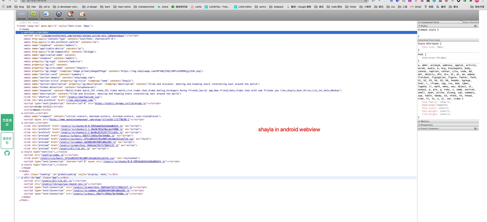

# spy-debugger

> 一站式页面调试、抓包工具。远程调试任何手机浏览器页面，任何手机移动端 webview（如：微信，HybridApp 等）。支持 HTTP/HTTPS，无需 USB 连接设备。

https://github.com/wuchangming/spy-debugger

[](https://www.npmjs.com/package/spy-debugger)
[](https://www.npmjs.com/package/spy-debugger)
[](https://www.npmjs.com/package/spy-debugger)

### Preview



### Install

```bash
npm install spy-debugger -g
```

### Usage

#### prepare:同一局域网下
#### step1:开启服务
```bash
spy-debugger -[p|e|w|i|b|c]
```
#### step2:
* Android设置代理步骤：设置 - WLAN - 长按选中网络 - 修改网络 - 高级 - 代理设置 - 手动
* iOS设置代理步骤：设置 - 无线局域网 - 选中网络 - HTTP代理手动

#### step3:安装证书 http://s.xxx

#### step4:手机访问你要调试的页面即可
