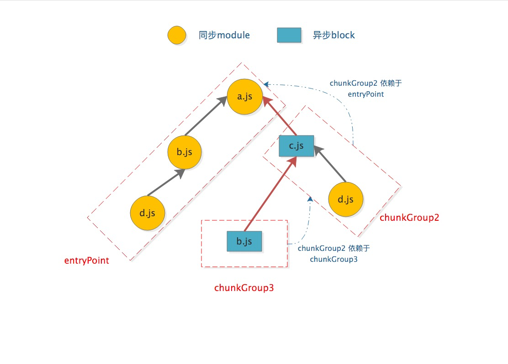

# chunk

> 当所有的 module 都被编译完成后，进入到 Compilation seal 阶段会开始生成 chunk

1. chunkGroup，每一个 entryPoint 就是一个 chunkGroup。一个 chunkGroup 可以包含多个 chunk，在生成/优化 chunk graph 时会用到；
2. chunk，由 module 组成,一个 chunk 可以包含多个 module，它是 webpack 编译打包后输出的最终文件；
3. module，就是不同的资源文件，包含了你的代码中提供的例如：js/css/图片 等文件，在编译环节，webpack 会根据不同 module 之间的依赖关系去组合生成 chunk

```js
// 1
{
    entry:"src/main.js"
}

// 2
import('./something.js').then()

// 3
module.exports = {
  optimization: {
    ...
  }
}

// runtime chunk
```


