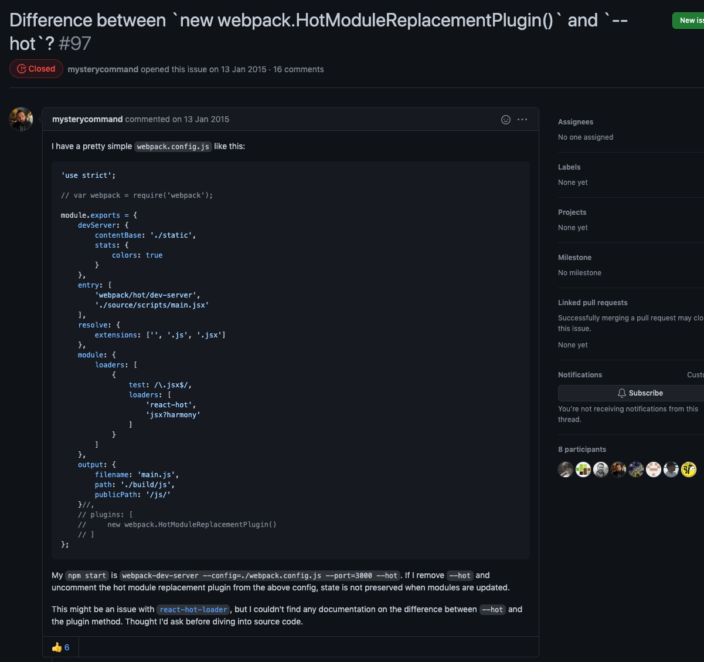
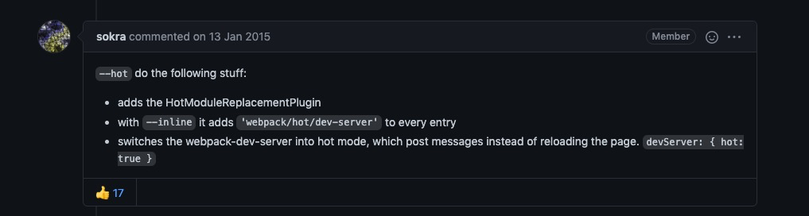

# 热更新 
Hot Module Replacement（以下简称 HMR)

[What exactly is Hot Module Replacement in Webpack?](https://stackoverflow.com/questions/24581873/what-exactly-is-hot-module-replacement-in-webpack)

> 当你对代码进行修改并保存后，Webpack 将对代码重新打包，并将新的模块发送到浏览器端，浏览器通过新的模块替换老的模块，这样在不刷新浏览器的前提下就能够对应用进行更新

https://webpack.docschina.org/api/hot-module-replacement/

1. webpack 的 watch 模式下,webpack 监听到文件变化对模块重新编译打包,保存在内存
2. webpack-dev-middleware 调用 webpack 暴露的 API对代码变化进行监控，并且告诉 webpack，将代码打包到内存中
3. webpack-dev-server 配置了devServer.watchContentBase 为 true,Server 会监听静态文件的变化，变化后会通知浏览器端对应用进行 live reload.
4. webpack-dev-server通过 sockjs 将 webpack 编译打包的各个阶段的状态信息告知浏览器端,包括新模块的 hash 值。
5. webpack/hot/dev-server 的工作就是根据 webpack-dev-server/client 传给它的信息以及 dev-server 的配置决定是刷新浏览器呢还是进行模块热更新
6. HotModuleReplacement.runtime 是客户端 HMR 的中枢，它接收到上一步传递给他的新模块的 hash 值，它通过 JsonpMainTemplate.runtime 向 server 端发送 Ajax 请求，服务端返回一个 json，该 json 包含了所有要更新的模块的 hash 值，获取到更新列表后，该模块再次通过 jsonp 请求，获取到最新的模块代码
7. HotModulePlugin 将会对新旧模块进行对比，决定是否更新模块，在决定更新模块后，检查模块之间的依赖关系，更新模块的同时更新模块间的依赖引用
8. 当 HMR 失败后，回退到 live reload 操作

