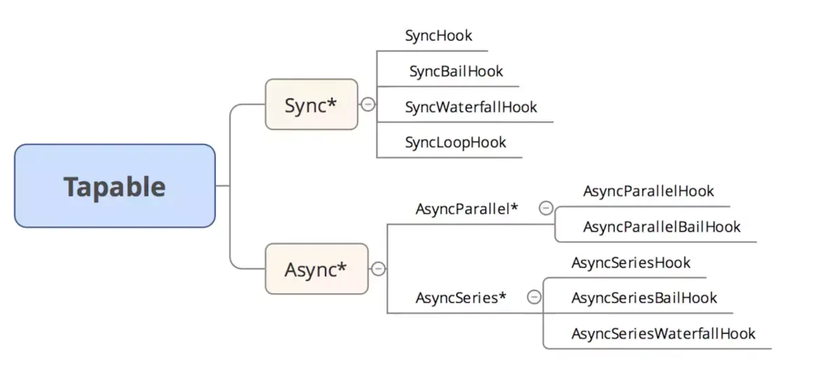
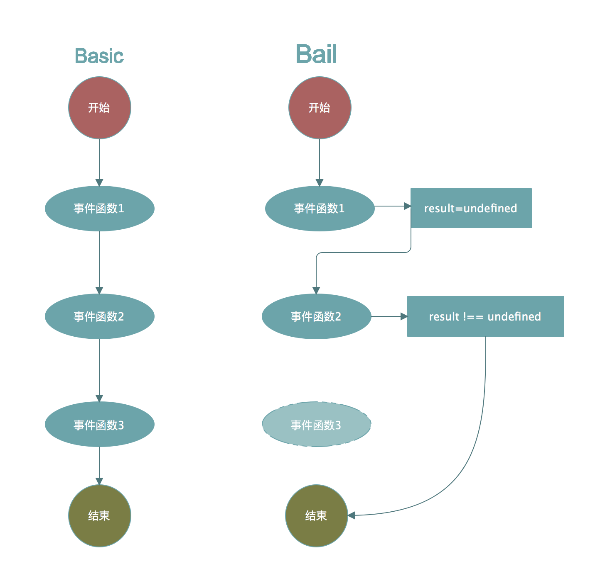
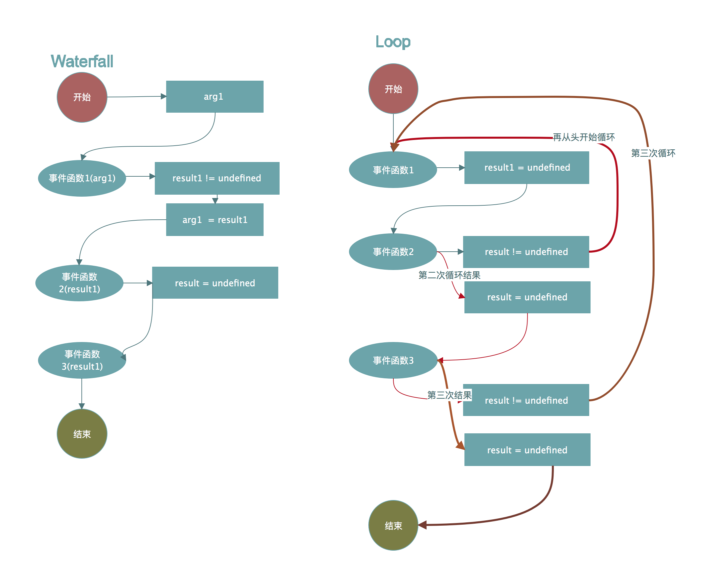
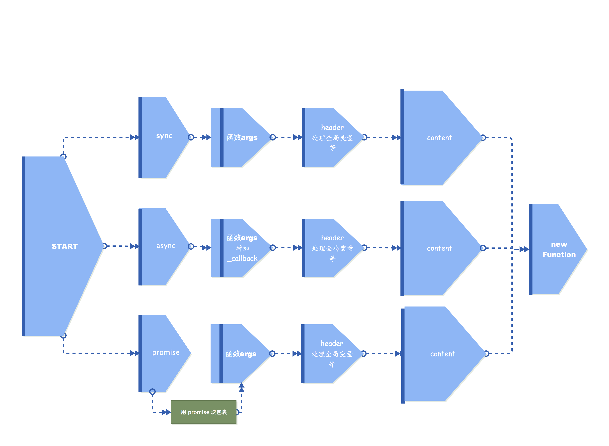

# tapable

> webpack 整个编译过程中暴露出来大量的 Hook 供内部/外部插件使用，同时支持扩展各种插件，而内部处理的代码，也依赖于 Hook 和插件。webpack 的整体执行过程，总的来看就是被事件驱动的。从一个事件，走向下一个事件。Tapable 用来提供各种类型的 Hook

```js
const {
  SyncHook,
  SyncBailHook,
  SyncWaterfallHook,
  SyncLoopHook,
  AsyncParallelHook,
  AsyncParallelBailHook,
  AsyncSeriesHook,
  AsyncSeriesBailHook,
  AsyncSeriesWaterfallHook,
} = require("tapable");
```



```js
// simple mock
class SyncHook {
  constructor() {
    this.hooks = [];
  }

  // 订阅事件
  tap(name, fn) {
    this.hooks.push(fn);
  }

  // 发布
  call() {
    this.hooks.forEach((hook) => hook(...arguments));
  }
}
```

### basic&bail



### waterfall&loop



### 懒编译


